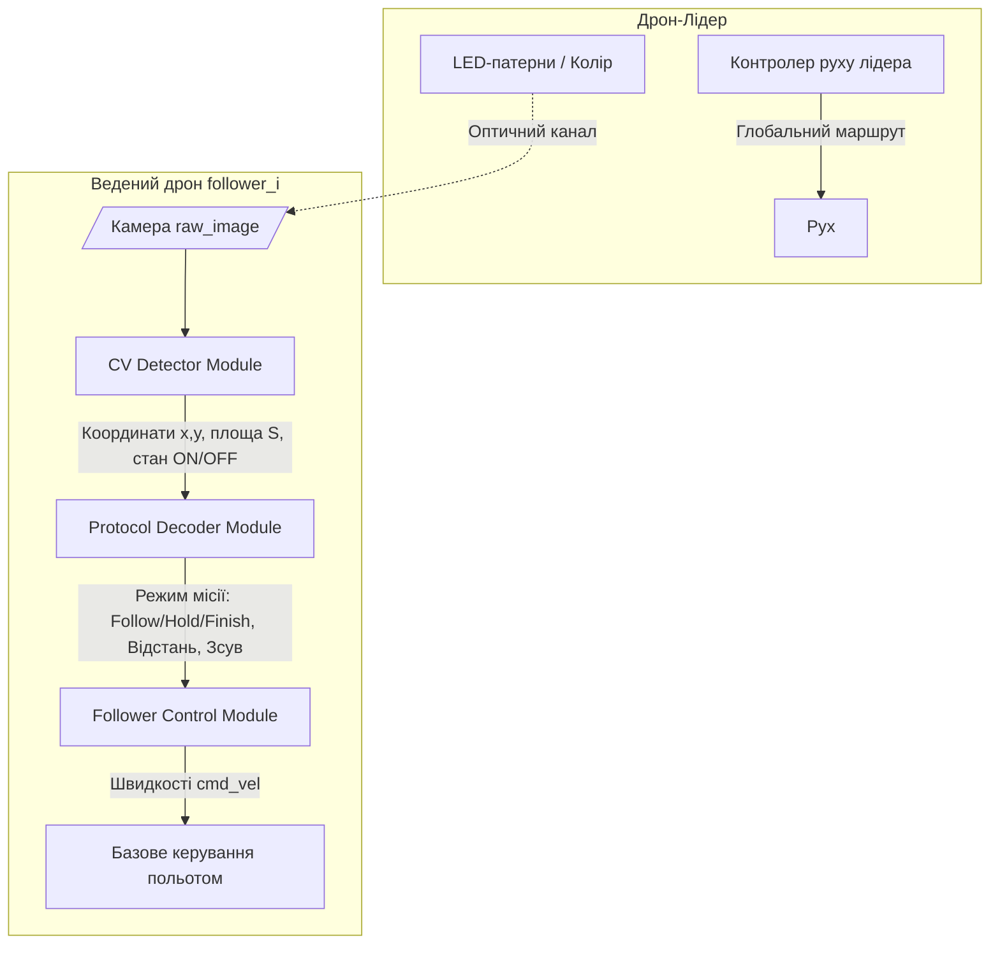

# План роботи на хакатоні ГЕНЕРА 2: Оптична комунікація рою дронів

> [!IMPORTANT]
> **Головна задача (Leader-Follower):** 
> Забезпечити рух ведених дронів (followers) за лідером (leader) в симуляторі Gazebo **без використання GPS, глобальних координат, ground truth або прямого цифрового зв'язку** (ROS-топіки/сокети від лідера заборонені). 
> Вся інформація передається виключно через камеру веденого дрона та світлодіодні LED-маяки на лідері.

---

## 1. Архітектура рішення

Пропонується розділити код веденого дрона на три взаємопов'язані модулі (ноди або класи):



### 1. Модуль Computer Vision (CV Detector)
*   **Вхід:** Кадр з камери веденого дрона (`/drone_i/camera/image_raw`).
*   **Процесинг:**
    1.  Конвертація в HSV для стійкого виділення кольору LED (змінні пороги для дня/сонця).
    2.  Фільтрація шуму (ерозія/дилатація або Gaussian blur).
    3.  Детекція контурів (`cv2.findContours`) або Blob detection.
    4.  Визначення центру світлодіода $(x, y)$ у пікселях та його площі $S$ (для оцінки відстані).
*   **Вихід:** Зсув від центру кадру $(\Delta x, \Delta y)$, площа світлової плями $S$, колір (якщо RGB) або логічний стан (ON/OFF).

### 2. Модуль декодування протоколу (Protocol Decoder)
*   **Вхід:** Дані від CV модуля в кожному кадрі.
*   **Процесинг:**
    *   **Для частотного кодування (якщо LED монохромний):** збереження буфера останніх $N$ кадрів з мітками часу та розрахунок частоти блимання ($f = 1/T$).
    *   **Для кольорового кодування (якщо колір LED змінюється):** пряме декодування стану за кольором.
*   **Вихід:** Режим місії (`FOLLOW`, `HOLD`, `FINISH`, `LOST`).

### 3. Модуль керування польотом (Follower Control)
*   **Вхід:** Дані про стан лідера, зсув $(\Delta x, \Delta y)$ та відстань (або площа $S$).
*   **Процесинг:**
    *   Генерація команд швидкості `/drone_i/cmd_vel` за допомогою пропорційних регуляторів (P-регулятори):
        *   **Yaw rate (кут повертання):** пропорційно горизонтальному відхиленню $\Delta x$.
        *   **Forward velocity (лінійна швидкість вперед/назад):** пропорційно помилці по відстані ($S_{target} - S_{current}$).
        *   **Altitude change (вгору/вниз):** пропорційно вертикальному відхиленню $\Delta y$.
    *   Обробка втрати сигналу (режим `LOST`).

---

## 2. Дизайн оптичного протоколу (LED-маяк)

Залежно від можливостей симулятора (чи можна змінювати колір LED динамічно, чи тільки блимати ON/OFF), обираємо один з двох варіантів:

### Варіант А: Кольоровий протокол (Рекомендований MVP)
*Найпростіший, найшвидший та найбільш стійкий до затримок камери.*
*   **Зелений LED:** Режим **FOLLOW** (лідер рухається, слідуй за ним).
*   **Жовтий/Оранжевий LED:** Режим **HOLD** (лідер завис, стій на місці).
*   **Червоний/Синій LED:** Режим **FINISH** (досягнуто цілі, виконай автопосадку Land).
*   **LED вимкнено або не видно:** Режим **LOST** (сигнал втрачено).

### Варіант Б: Частотний протокол (Якщо LED тільки одного кольору)
*Вимагає буферизації кадрів та фільтрації шумів блимання.*
*   **Постійно горить (або повільно блимає, наприклад 1.5 Гц):** Режим **FOLLOW**.
*   **Швидке блимання (наприклад 5 Гц):** Режим **HOLD**.
*   **Дуже швидке блимання (наприклад 10 Гц):** Режим **FINISH**.
*   **Постійно вимкнено (Timeout > 1.5-2 сек):** Режим **LOST**.

---

## 3. Алгоритм слідування та регулювання (Follower Control Loop)

Для стабільного польоту використовуємо роздільні **P / PD контролери**:

$$\text{Yaw Rate} = K_{p, yaw} \cdot \Delta x$$

$$\text{Forward Speed} (V_x) = K_{p, dist} \cdot (S_{target} - S) - K_{d, dist} \cdot \frac{dS}{dt}$$

$$\text{Vertical Speed} (V_z) = K_{p, alt} \cdot \Delta y$$

> [!TIP]
> **Обробка втрати сигналу (Robustness):**
> 1.  Якщо LED зникає з кадру, дрон негайно скидає лінійні швидкості в 0 та переходить у **safe hover** (зависання).
> 2.  Запускається таймер очікування (наприклад, 2 секунди).
> 3.  Якщо сигнал не з'явився, дрон починає повільно обертатися навколо своєї осі (Yaw search) у напрямку, де LED був помічений востаннє.
> 4.  При виявленні LED слідування відновлюється. Якщо за 15 секунд сигнал не знайдено — виконується безпечна автопосадка (`Land`).

---

## 4. Покроковий план роботи на 2 дні

### День 1: База, CV та Перші польоти (19 червня)
*   **Фаза 1: Налаштування середовища (09:00 - 11:30)**
    *   Створити робочу копію стартового репозиторію.
    *   Запустити симулятор Gazebo з лідером та веденими.
    *   Протестувати ручне керування веденим через ROS 2 топіки (`cmd_vel`), щоб переконатися, що фізика польоту працює.
    *   Зробити запис кадрів з камери веденого дрона для CV-аналізу.
*   **Фаза 2: Розробка CV модуля (11:30 - 14:30)**
    *   Написати скрипт для калібрування HSV порогів (інструмент для вибору кольору LED).
    *   Створити ROS 2 ноду для детекції LED (пошук контурів, центру, площі).
    *   Вивести debug-вікно з виділеним контуром для візуального контролю.
*   **Фаза 3: Follower Control (14:30 - 18:00)**
    *   Реалізувати простий пропорційний закон керування для утримання LED у центрі кадру.
    *   Налаштувати коефіцієнти регулятора ($K_p$) для Yaw та Altitude на статичному лідері.
    *   Запустити рух лідера по прямій лінії та налаштувати коефіцієнт швидкості вперед ($K_{p, dist}$).
*   **Фаза 4: Проміжний чекпоінт (18:00 - 19:00)**
    *   Запустити перший інтеграційний тест: Лідер летить за простим маршрутом $\rightarrow$ 1 Ведений слідує за ним на постійному світлі LED.

---

### День 2: Протокол, Робастність та Оптимізація (20 червня)
*   **Фаза 5: Розробка протоколу LED та Стан місії (09:00 - 11:30)**
    *   Створити логіку кодування LED на лідері (нода `led_control`).
    *   Написати декодер на веденому (детекція зміни кольору або частоти блимання).
    *   Інтегрувати стан декодера зі схемою поведінки дрона (Follow/Hold/Land).
*   **Фаза 6: Робастність та Обхід перешкод (11:30 - 13:30)**
    *   Реалізувати логіку втрати сигналу (Safe Hover $\rightarrow$ Search Yaw $\rightarrow$ Land).
    *   Протестувати сценарій **T2** (тимчасова втрата сигналу на 1-2 сек).
    *   Протестувати сценарій **T3** (обліт простої перешкоди лідером, коли ведений має зберегти траєкторію).
*   **Фаза 7: Оцінювання, Метрики та Документація (13:30 - 15:00)**
    *   Запустити публічні тести T1, T2, T3 через скрипт `evaluate.py`.
    *   Перевірити файл `results.json` на наявність помилок та відповідність метрикам.
    *   Підготувати README.md (описати архітектуру та протокол LED).
    *   Записати демонстраційне відео (як бекап для презентації).
*   **Фаза 8: Презентація та Фінал (15:00 - 19:30)**
    *   Підготувати слайди (архітектура, CV, протокол, результати метрик).
    *   Підготуватися до запитань журі щодо античитингу (довести, що глобальні топіки не читаються).

---

## 5. Технічні вимоги та вирішення несумісності

Офіційні вимоги організаторів для запуску симулятора:
* **ОС:** Ubuntu 22.04 LTS (нативно на ПК)
* **ROS 2:** Humble Desktop (`ros-humble-desktop`)
* **Gazebo:** Harmonic (`gz-harmonic`)
* **PX4 Autopilot:** v1.15.4 (встановлений та зібраний у `~/PX4-Autopilot`)
* **MAVSDK Python**

> [!WARNING]
> **Конфлікт версій:** Ваша поточна система працює на **Ubuntu 24.04** із встановленим **ROS 2 Jazzy**. 
> Оскільки ROS 2 Humble не підтримується нативно на Ubuntu 24.04, у нас є два шляхи:
> 1. **Запуск через Docker (Рекомендовано):** Використати Docker-контейнер на базі Ubuntu 22.04 + ROS 2 Humble, який має бути у складі стартового пакету (`docker/Dockerfile` та `docker-compose.yml`), прокинувши X11 дисплей та апаратне прискорення GPU.
> 2. **Нативна адаптація під Jazzy:** Спробувати зібрати та запустити проєкт на вашому хості з ROS 2 Jazzy + Gazebo Harmonic. Оскільки ви вже збирали PX4-Autopilot на хості, цей варіант може спрацювати, якщо кодові API стартового пакету не використовують застарілі фічі Humble.

---

## 6. Перші кроки для старту (Чекліст)

1.  [ ] **Отримати стартовий репозиторій:** Завантажити або клонувати репозиторій хакатону.
2.  [ ] **Визначити шлях запуску:** Подивитися, чи є в стартовому пакеті папка `docker/` з Dockerfile та docker-compose.yml.
3.  [ ] **Дозволити підключення до X11 дисплею (для Docker):**
    ```bash
    xhost +local:root
    ```
4.  [ ] **Запустити базовий сценарій:**
    *   **Якщо через Docker:**
        ```bash
        docker compose up --build
        ```
    *   **Якщо нативно на хості:**
        ```bash
        PX4_DIR=~/PX4-Autopilot ./run_linux
        ```
5.  [ ] **Перевірити GPU прискорення:** Запустити симуляцію та переконатися, що Gazebo працює плавно завдяки інтегрованій карті Intel Iris Xe (без фризів, які притаманні софтверному рендерингу `llvmpipe`).

